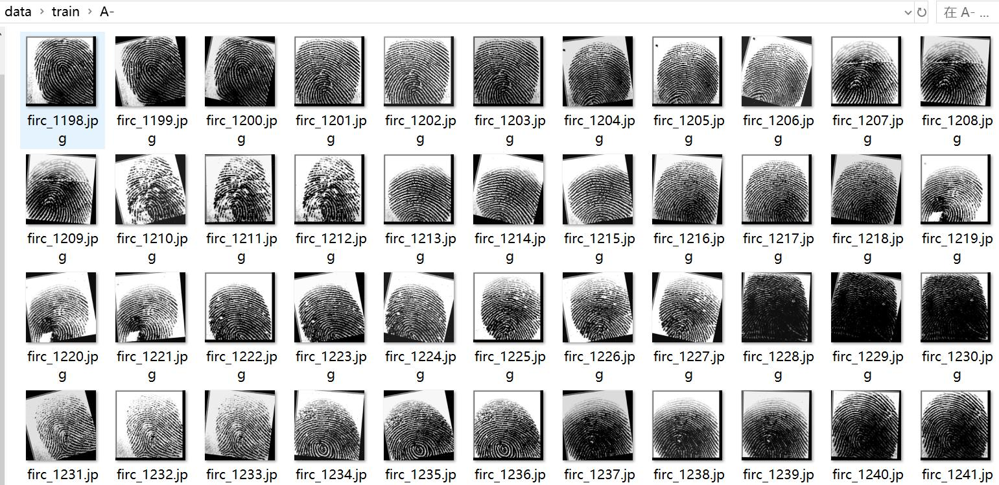
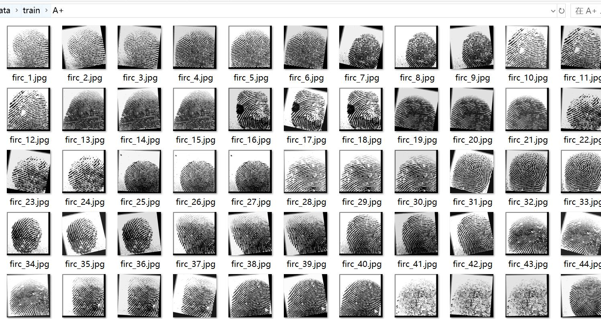
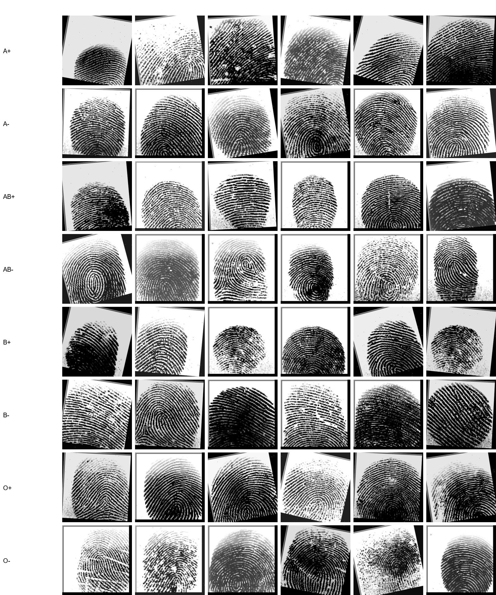

# Blood Type Fingerprint Classification Dataset: 14365 Images in 8 Categories

Dataset Type: Image classification for use, not suitable for object detection without labeled files.
Dataset Format: Only contains JPG images, each category folder contains the corresponding image.
Number of Images (JPG File Count): 14365
Number of Categories: 8
Category Names: ['A+', 'A-', 'AB+', 'AB-', 'B+', 'B-', 'O+', 'O-']
Image Count per Category:
Training Set Image Count: 12570
- A+ Training Set Image Count: 1197
- A- Training Set Image Count: 2085
- AB+ Training Set Image Count: 1482
- AB- Training Set Image Count: 1605
- B+ Training Set Image Count: 1359
- B- Training Set Image Count: 1602
- O+ Training Set Image Count: 1746
- O- Training Set Image Count: 1494
Validation Set Image Count: 1196
- A+ Validation Set Image Count: 106
- A- Validation Set Image Count: 217
- AB+ Validation Set Image Count: 129
- AB- Validation Set Image Count: 149
- B+ Validation Set Image Count: 135
- B- Validation Set Image Count: 141
- O+ Validation Set Image Count: 177
- O- Validation Set Image Count: 142
Test Set Image Count: 599
- A+ Test Set Image Count: 60
- A- Test Set Image Count: 96
- AB+ Test Set Image Count: 82
- AB- Test Set Image Count: 76
- B+ Test Set Image Count: 60
- B- Test Set Image Count: 66
- O+ Test Set Image Count: 92
- O- Test Set Image Count: 67
Total Images:
- A+ Total Images: 1363
- A- Total Images: 2398
- AB+ Total Images: 1693
- AB- Total Images: 1830
- B+ Total Images: 1554
- B- Total Images: 1809
- O+ Total Images: 2015
- O- Total Images: 1703
Important Note: No specific note provided currently.
Special Statement: This dataset does not guarantee the accuracy of the trained models or the weights file.
Image Preview:

## Images

Here is a pay link on Stripe ( https://buy.stripe.com/3cs8yP7sY87d0vu9AB ). Please contact me lonlonago@foxmail.com after funding $89, and I will send you a complete data files , thank you!

